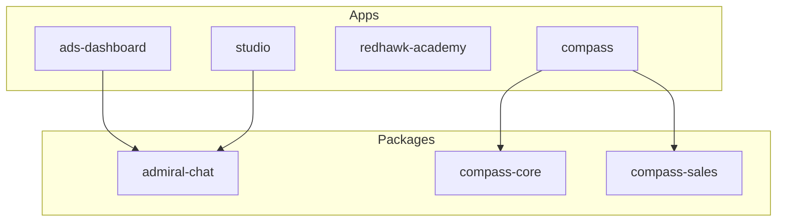

# LIDS Repository Context for AI Agents

## 1. Repository Overview
**Root Path:** `C:\LifeOS\LIDS`
**Type:** Monorepo (npm workspaces / Turborepo-style)
**Primary Stack:** React (Vite), Express, Node.js, TypeScript, Tailwind CSS.
**Core Philosophy:** Frontend-first, Offline-first (Dexie.js), "Twenty CRM" as Auth/Identity Provider.

## 2. Directory Map & Purpose

| Directory | Purpose | Key Conventions |
|-----------|---------|-----------------|
| `apps/ads-dashboard` | **MAIN APP**. The "LIDS" Dashboard for Sales Reps. | React, Offline-first, Dexie DB. |
| `apps/compass` | AI Agent Interface (UI). | Connects to `packages/compass-*`. |
| `apps/redhawk-academy` | LMS / Gamified Training Platform. | "Boss Battles", Certifications. |
| `apps/twenty-crm` | The Canonical CRM instance (Dockerized). | **DO NOT TOUCH** core CRM code. |
| `packages/compass-core` | Shared AI logic / Base Agent Framework. | Stateless logic, distinct from UI. |
| `packages/admiral-chat` | Shared Chat UI components. | Used by Studio & ADS Dashboard. |
| `projects/` | **WORKFLOW ROOT**. All work must happen here. | See `projects/README.md`. |
| `docs/` | System Documentation. | Architecture, Deployments, Security. |

## 3. Core Mandates & Invariants

### Authentication & Identity
*   **Identity Provider:** Twenty CRM (`workspaceMemberId` is the unique key).
*   **Auth Flow:** Apps check `localStorage` for `workspaceMemberId`. If missing, redirect to login (email lookup).
*   **Prohibited:** DO NOT add Supabase, Firebase, or other auth providers.

### Data Architecture
*   **Offline First:** `apps/ads-dashboard` uses `Dexie.js` (IndexedDB) as the primary data store.
*   **Sync:** Syncs with Twenty CRM REST API when online.
*   **Secrets:** NO API KEYS in client-side code. Use server-side proxies (`/api/*`).

### Infrastructure
*   **Production:** Digital Ocean Droplet (Standalone).
*   **Optional Backend:** `admiral-server` (AI, Voice) is optional. Apps must function if it is down.

## 4. Development Workflow ("The Project System")

**Rule:** Do not edit code randomly. All changes must be tracked in a "Project".

1.  **Check Active Projects:** Look in `projects/active/`.
2.  **Start New Project:**
    *   Create `projects/active/XX-project-name/`
    *   Create `AUDIT_FINDINGS.md` (Analysis)
    *   Create `CODEX_IMPLEMENTATION_PLAN.md` (Plan)
3.  **Execute:** Modify code in `apps/` or `packages/` based on the plan.
4.  **Complete:** Move folder to `projects/completed/` when done.

## 5. Dependency Graph

## 6. Key Commands

*   `npm run dev`: Starts local dev servers.
*   `npm run build`: Builds all apps.
*   `/help`: In CLI, shows this agent's help.
